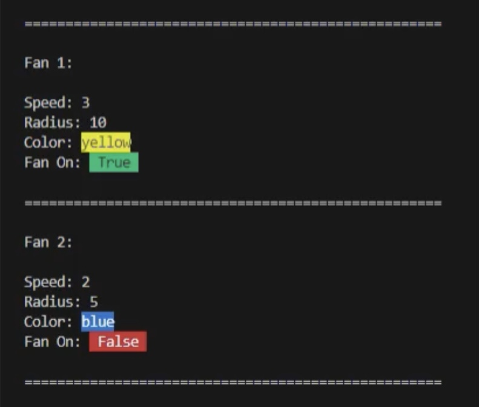
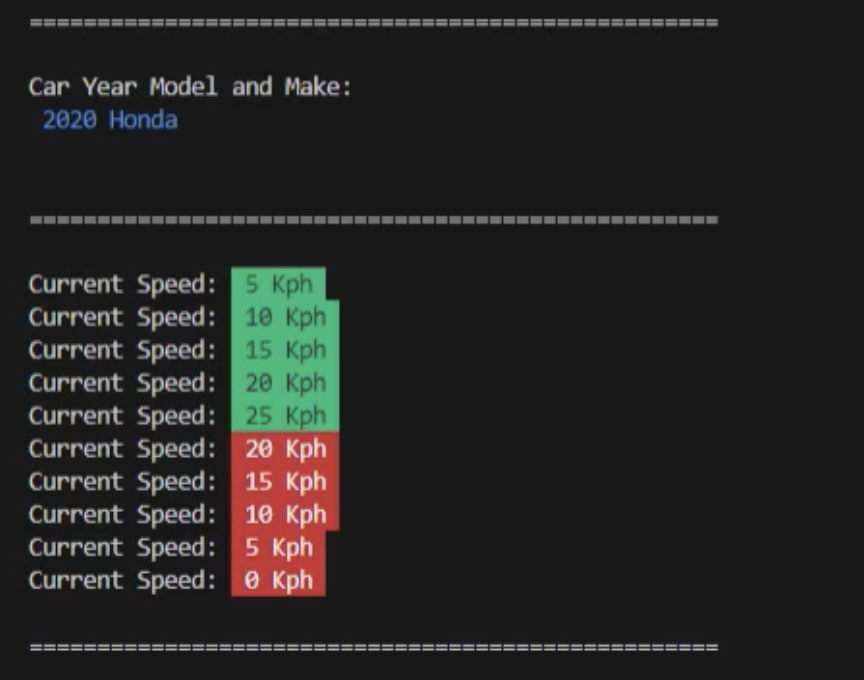
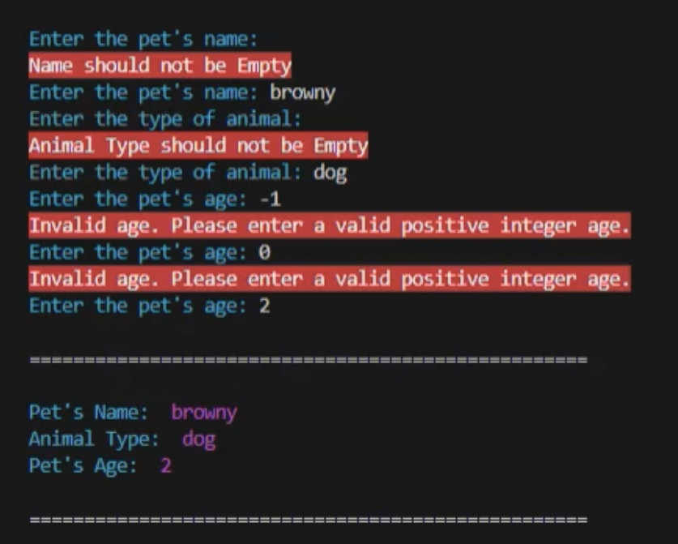

# Create a Class for Fan, Car, Pet applying OOP (ABSTRACTION AND ENCAPSULATION)

## Class Fan
### Design a class named Fan to represent a fan. The class contains:
- Three constants named SLOW, MEDIUM, and FAST with the values 1, 2, and 3 to denote the fan speed.
- A private int data field named speed that specifies the speed of the fan.
- A private bool data field named on that specifies whether the fan is on (the default is False).
- A private float data field named radius that specifies the radius of the fan.
- A private string data field named color that specifies the color of the fan.
- The accessor(getters)  and mutator(setters)  methods for all four data fields.
- A constructor that creates a fan with the specified speed (default SLOW), radius (default 5), color (default blue), and on (default False).

### Write a test program named TestFan that creates two Fan objects. For the first object, assign the maximum speed, radius 10, color yellow, and turn it on. Assign medium speed, radius 5, color blue, and turn it off for the second object. Display each object’s speed, radius, color, and on properties.

# Example Output 

### Output in Class Fan

## Class Car
### Write a class named Car that has the following data attributes:
- __year_model (for the car’s year model)
- __make (for the make of the car)
- __speed (for the car’s current speed)

### The Car class should have an __init__ method that accepts the car’s year model and make as arguments. These values should be assigned to the object’s __year_model and __make data attributes. It should also assign 0 to the __speed data attribute.

### The class should also have the following methods:
- accelerate()
The accelerate method should add 5 to the speed data attribute each time it is called.
- brake()
The brake method should subtract 5 from the speed data attribute each time it is called.
- get_speed()
The get_speed method should return the current speed.

### Next, design a program that creates a Car object then calls the accelerate method five times. After each call to the accelerate method, get the current speed of the car and display it. Then call the brake method five times. After each call to the brake method, get the current speed of the car and display it.

# Example Output 

### Output in Class Car

## Class Pet
### Write a class named Pet, which should have the following data attributes:
- __name (for the name of a pet)
- __animal_type (for the type of animal that a pet is. Example values are ‘Dog’, ‘Cat’, and ‘Bird’)
- __age (for the pet’s age)

### The Pet class should have an __init__ method that creates these attributes. It should also have the following methods:
- set_name()
This method assigns a value to the __name field.
- set_animal_type()
This method assigns a value to the __animal_type field.
- set_age()
This method assigns a value to the __age field.
- get_name()
This method returns the value of the __ name field.
- get_animal_type()
This method returns the value of the __animal_type field.
- get_age()
This method returns the value of the __age field.

### Once you have written the class, write a program that creates an object of the class and prompts the user to enter the name, type, and age of his or her pet. This data should be stored as the object’s attributes. Use the object’s accessor methods to retrieve the pet’s name, type, and age and display this data on the screen.

# Example Output with Error Handling

### Output in Class Pet

# How To Use / Run
1. Install Python on your computer to run the code. You can download its latest version here: https://www.python.org/downloads/ 
2. Copy the code from the repository. 
3. Open an IDE and paste the code. 
4. Save the file with a .py extension. 
5. Run the code. 
